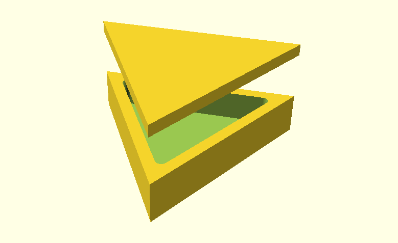

#OpenSCAD Triangle Box

Parametric triangle box for your alien friend...



This box was made to learn to use a CNC machine. It is parametric, thus one can edit specific variables in case a iteration fails and has to be adjusted. 

Open the file `preview.scad` to see the 3D model of the box. Use the file `projections.scad` if you want to export `.dxf` files for CNC machining. Check that you calculate the right inner corner radius, for the cap it should be less the difference between box and cap wall thicknesses. For example if:

```
boxWall = 10;
capWall = 10.5;
boxInnerRadius = 5;
capInnerRadius = boxInnerRadius - (capWall - boxWall);
```

License: [MIT](LICENSE)